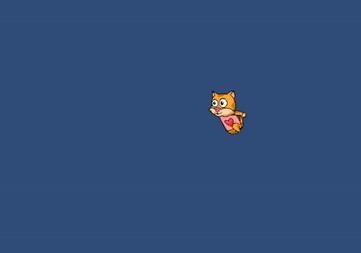
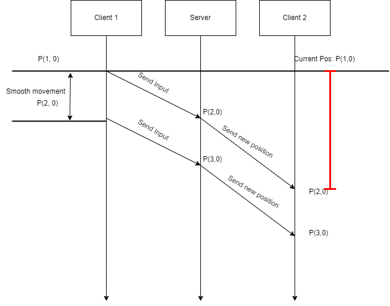

Giải quyết một vấn đề mình gặp phải trong quá trình học làm multiplayer.

## Vấn đề

Khác với game offline một người chơi, multiplayer cần hiển thị cả những người chơi khác trên bản đồ. Cơ chế đại loại như thế này: <br />

- Client (người chơi) sẽ gửi vị trí của mình đến Server mỗi khi người chơi di chuyển.
- Server dùng vị trí này để Validate (chống gian lận), đồng thời cung cấp thông tin cho những người chơi khác.
- Client khác sẽ lấy dữ liệu vị trí từ Server để hiển thị lên máy của mình.

Ban đầu mình sử dùng một hàm kiểu như này:

```cs title="SyncViewWithServer()"
Vector3 targetPos = state.position; // get last position from server
var step =  speed * Time.deltaTime; // calculate distance to move per frame
transform.position = Vector3.MoveTowards(transform.position, targetPos, step);
```

Dùng hàm MoveTowards mục đích để di chuyển mượt mà từ vị trí hiện tại đến vị trí lấy được từ server (Có thể dùng hàm Lerp hoặc SmoothDamp).
Trong điều kiện tốt đẹp như Server có time step = 20, client có độ trễ thấp mọi thứ hoạt động tốt. Nhưng hãy xét với trường hợp bên dưới và kết quả như trên hình.

```jsx title="Server time step = 1000/300 (Tần suất Server gửi bản cập nhật trạng thái đến client )"
|          | lag(ms)  |
|----------|----------|
|Client-1  | 300      |
|Client-2  | 300      |
```



**Nguyên nhân từ đâu**. Để tìm ra nguên nhân, cần phải ngẫm lại cách nó hoạt động như thế nào. Hãy cùng xem hình bên dưới.



Khi Client-1 di chuyển, nhân vật sẽ được di chuyển ngay lập tức do cơ chế dự đoán phía Client (để cập nhật trạng thái tức thì với user hiện tại). Nhưng ở Client-2 sẽ cần đợi phản hồi từ Server để biết Client-1 đã di chuyển, và cập nhật vị trí mới cho nhân vật của Client-1. Quá trình nhận và gửi gói tin sẽ mất một khoảng thời gian do **độ trễ của Client** cộng thêm **time step của Server** (**khoảng tô đỏ**), lúc này nhân vật sẽ đứng yên không làm gì. =>Cứ một thời gian nhân vật lại di chuyển một đoạn, chính vì thế đã gây ra hiện tượng cà giật như trên.

## Entity interpolation

Sử dụng [Nội Suy](https://en.wikipedia.org/wiki/Linear_interpolation) làm cho chuyển động mượt mà. Còn một cách nữa là sử dụng Ngoại Suy nhưng nó chỉ sử dụng trong một vài trường hợp. <br/>
Chìa khóa là thay vì hiển thị người chơi khác ngay khi nhận được dữ liệu về vị trí từ Server, bây giờ sẽ hiển thị người chơi khác trong quá khứ.


